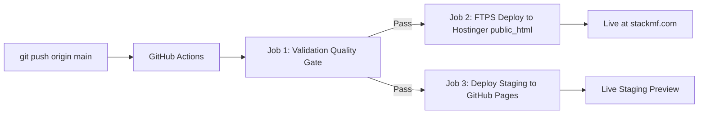

# StackMF CI/CD Automated Deployment Guide

This repository includes a production-grade **GitHub Actions CI/CD Pipeline** ([`.github/workflows/deploy.yml`](.github/workflows/deploy.yml)) that automatically tests, validates, and deploys every commit pushed to `main` straight to `https://stackmf.com` via secure FTPS.

---

## Architecture Flow



1. **Stage 1 (Quality Gate & Validation):** Automatically checks that all SEO/GEO files (`robots.txt`, `sitemap.xml`, `llms.txt`, `llms-full.txt`) exist and validates the JSON-LD schema structure in `index.html`.
2. **Stage 2 (Production Hostinger Deploy):** Uses TLS-encrypted FTPS (`SamKirkland/FTP-Deploy-Action`) to sync changed files directly into Hostinger's `public_html/` folder.
3. **Stage 3 (Staging / Backup Mirror):** Automatically deploys a live preview to GitHub Pages.

---

## 3-Minute Setup Instructions

### Step 1: Initialize Git and Push to GitHub

In your local terminal (inside `c:\Users\Anshu\source\stackmf`):

```bash
# 1. Initialize git
git init
git add .
git commit -m "feat: launch next-gen stackmf platform with automated CI/CD"
git branch -M main

# 2. Add your GitHub remote repository (replace with your repo URL)
git remote add origin https://github.com/YOUR_GITHUB_USERNAME/stackmf.git

# 3. Push to GitHub
git push -u origin main
```

---

### Step 2: Retrieve Hostinger FTP Credentials

1. Log in to [Hostinger hPanel](https://hpanel.hostinger.com/).
2. Go to **Websites** &rarr; Select `stackmf.com` &rarr; Click **Manage**.
3. In the left search bar, type **FTP Accounts** (under the *Files* section).
4. You will see:
   - **FTP Host / Server IP** (e.g. `ftp.stackmf.com` or an IP like `185.xxx.xxx.xxx`)
   - **FTP Username** (e.g. `u123456789`)
   - **FTP Password** (click *Change Password* if you do not remember it)
   - **Port**: `21`

---

### Step 3: Add Repository Secrets in GitHub

1. Open your repository on GitHub (`https://github.com/YOUR_USERNAME/stackmf`).
2. Navigate to **Settings** &rarr; **Secrets and variables** &rarr; **Actions**.
3. Click **New repository secret** and add the following:

| Secret Name | Value | Required? |
| :--- | :--- | :--- |
| `HOSTINGER_FTP_SERVER` | Your Hostinger FTP Host (e.g., `ftp.stackmf.com` or IP) | **Yes** |
| `HOSTINGER_FTP_USERNAME` | Your Hostinger FTP Username | **Yes** |
| `HOSTINGER_FTP_PASSWORD` | Your Hostinger FTP Password | **Yes** |
| `HOSTINGER_FTP_PORT` | `21` | Optional (default: 21) |
| `HOSTINGER_TARGET_DIR` | `public_html/` | Optional (default: public_html/) |

---

### Step 4: Verify Deployment

1. Once the secrets are saved, make any change or trigger the workflow manually under the **Actions** tab by selecting **StackMF Production CI/CD Pipeline** &rarr; **Run workflow**.
2. GitHub Actions will execute the validation test and sync the website to Hostinger in ~30 seconds.
3. Visit `https://stackmf.com` to see the live site updated.
